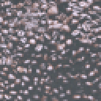
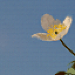

# Lite-Sora

## Introduction

The lite-sora project is an initiative to replicate Sora, co-launched by East China Normal University and the ModelScope community. It aims to explore the minimal reproduction and streamlined implementation of the video generation algorithms behind Sora. We hope to provide concise and readable code to facilitate collective experimentation and improvement, continuously pushing the boundaries of open-source video generation technology.

**The source code will be released later (maybe a few days). We are refining our code for better readability and usability.**

## Roadmap

* [x] Implement the base architecture
  * [ ] Models
    * [x] Text Encoder（based on Stable Diffusion XL's [Text Encoder](https://huggingface.co/stabilityai/stable-diffusion-xl-base-1.0/blob/main/text_encoder_2/model.safetensors)）
    * [x] VideoDiT（based on [Facebook DiT](https://github.com/facebookresearch/DiT)）
    * [ ] VideoVAE
  * [x] Scheduler（based on [DDIM](https://arxiv.org/abs/2010.02502)）
  * [x] Trainer（based on [PyTorch-lightning](https://lightning.ai/docs/pytorch/stable/)）
* [x] Validate on small datasets
  * [x] [Pixabay100](https://github.com/ECNU-CILAB/Pixabay100)
* [ ] Train Video Encoder & Decoder on large datasets
* [ ] Train VideoDiT on large datasets

## Usage

### Python Environment

```
conda env create -f environment.yml
conda activate litesora
```

### Download Models

* `models/text_encoder/model.safetensors`: Stable Diffusion XL's Text Encoder. [download](https://huggingface.co/stabilityai/stable-diffusion-xl-base-1.0/resolve/main/text_encoder_2/model.safetensors)
* `models/denoising_model/model.safetensors`：We trained a denoising model using a small dataset [Pixabay100](https://github.com/ECNU-CILAB/Pixabay100). This model serves to demonstrate that our training code is capable of fitting the training data properly, with a resolution of 64*64. **Obviously this model is overfitting due to the limited amount of training data, and thus it lacks generalization capability at this stage. Its purpose is solely for verifying the correctness of the training algorithm.** [download](https://huggingface.co/ECNU-CILab/lite-sora-v1-pixabay100/resolve/main/denoising_model/model.safetensors)

### Training

```python
from litesora.data import TextVideoDataset
from litesora.models import SDXLTextEncoder2
from litesora.trainers.v1 import LightningVideoDiT
import lightning as pl
import torch


if __name__ == '__main__':
    # dataset and data loader
    dataset = TextVideoDataset("data/pixabay100", "data/pixabay100/metadata.json",
                               num_frames=64, height=64, width=64)
    train_loader = torch.utils.data.DataLoader(dataset, shuffle=True, batch_size=1, num_workers=8)

    # model
    model = LightningVideoDiT(learning_rate=1e-5)
    model.text_encoder.load_state_dict_from_diffusers("models/text_encoder/model.safetensors")

    # train
    trainer = pl.Trainer(max_epochs=100000, accelerator="gpu", devices="auto", callbacks=[
        pl.pytorch.callbacks.ModelCheckpoint(save_top_k=-1)
    ])
    trainer.fit(model=model, train_dataloaders=train_loader)
```

While the training program is running, you can launch `tensorboard` to see the training loss.

```
tensorboard --logdir .
```

### Inference

```python
from litesora.models import SDXLTextEncoder2, VideoDiT
from litesora.pipelines import PixelVideoDiTPipeline
from litesora.data import save_video
import torch


# models
text_encoder = SDXLTextEncoder2.from_diffusers("models/text_encoder/model.safetensors")
denoising_model = VideoDiT.from_pretrained("models/denoising_model/model.safetensors")

# pipeline
pipe = PixelVideoDiTPipeline(torch_dtype=torch.float16, device="cuda")
pipe.fetch_models(text_encoder, denoising_model)

# generate a video
prompt = "woman, flowers, plants, field, garden"
video = pipe(prompt=prompt, num_inference_steps=100)

# save the video (the resolution is 64*64, we enlarge it to 512*512 here)
save_video(video, "output.mp4", upscale=8)
```

### Results (Experimental)

We trained a denoising model using a small dataset [Pixabay100](https://github.com/ECNU-CILAB/Pixabay100). This model serves to demonstrate that our training code is capable of fitting the training data properly, with a resolution of 64*64. **Obviously this model is overfitting due to the limited amount of training data, and thus it lacks generalization capability at this stage. Its purpose is solely for verifying the correctness of the training algorithm.** [download](https://huggingface.co/ECNU-CILab/lite-sora-v1-pixabay100/resolve/main/denoising_model/model.safetensors)

|airport, people, crowd, busy|beach, ocean, waves, water, sand|bee, honey, insect, beehive, nature|coffee, beans, caffeine, coffee, shop|
|-|-|-|-|
|||||
|fish, underwater, aquarium, swim|forest, woods, mystical, morning|ocean, beach, sunset, sea, atmosphere|hair, wind, girl, woman, people|
|||||
|reeds, grass, wind, golden, sunshine|sea, ocean, seagulls, birds, sunset|woman, flowers, plants, field, garden|wood, anemones, wildflower, flower|
|||||
